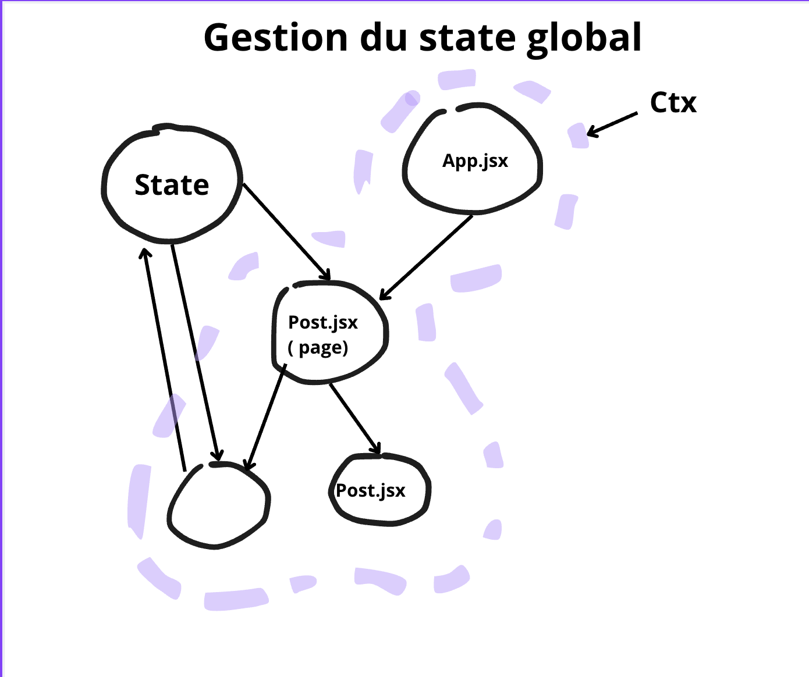

# 🎓 Context API de React

## 🔍 Pourquoi utiliser la Context API ?

Dans une application React, on passe souvent les données de composant en composant via les props. Cela fonctionne bien pour une petite arborescence, mais devient vite lourd à maintenir à mesure que l'arbre s'agrandit.

> La Context API permet de **centraliser des données globales** et de les rendre disponibles à **n'importe quel composant** sans passer par des props intermédiaires.

---

## 🧠 Concepts Clés

### 1. **createContext**
> Crée un contexte, c'est-à-dire un objet qui contiendra les données globales à partager.

```js
import { createContext } from 'react';

const MyContext = createContext();
```

### 2. **Provider**
> Fournit les données du contexte à l'arborescence de composants.

```js
<MyContext.Provider value={/* données à partager */}>
  <App />
</MyContext.Provider>
```

### 3. **useContext**
> Permet de consommer les données du contexte dans un composant.

```js
import { useContext } from 'react';

const data = useContext(MyContext);
```

---

Application du cours pour gérer une **TODO liste** avec :

- Un **titre unique** pour chaque tâche
- Un **statut** (ex. : `à faire` / `fait`)
- La possibilité de **changer le statut**
- Un **store centralisé** avec `Context + useReducer`

---

## 🗂 Structure des fichiers

```
src/
├── components/
│   └── Task.jsx
├── context/
│   └── TaskContext.jsx
├── services/
│   └── reducer.js
├── pages/
│   └── TaskList.jsx
├── App.js
└── index.js
```

---

## `En image`



---

## 1️⃣ `ctx.jsx` – Création du contexte + provider

```js
// context/ctx.jsx
import React, { createContext, useReducer } from 'react';
import { reducer, initialState } from '../services/reducer';

export const TaskContext = createContext();

export const TaskProvider = ({ children }) => {
  const [state, dispatch] = useReducer(reducer, initialState);

  return (
    <TaskContext.Provider value={[state, dispatch]}>
      {children}
    </TaskContext.Provider>
  );
};
```

---

## 2️⃣ `reducer.js` – La logique métier

```js
// services/reducer.js
export const initialState = {
  tasks: [],
  message: null,
};

export const reducer = (state, action) => {
  switch (action.type) {
    case 'ADD_TASK':
      const exists = state.tasks.some(
        (task) => task.title.toLowerCase() === action.title.toLowerCase()
      );

      if (exists) {
        return {
          ...state,
          message: `La tâche "${action.title}" existe déjà.`,
        };
      }

      return {
        ...state,
        tasks: [
          ...state.tasks,
          { title: action.title, status: 'doing' },
        ],
        message: null,
      };

    case 'TOGGLE_STATUS':
      return {
        ...state,
        tasks: state.tasks.map((task) =>
          task.title === action.title
            ? {
                ...task,
                status: task.status === 'todo' ? 'done' : 'doing',
              }
            : task
        ),
      };

    case 'DELETE_TASK':
      return {
        ...state,
        tasks: state.tasks.filter((task) => task.title !== action.title),
      };

    case 'CLEAR_MESSAGE':
      return {
        ...state,
        message: null,
      };

    default:
      return state;
  }
};
```

---

## 3️⃣ `Task.jsx` – Composant individuel

```js
// components/Task.jsx
import React, { useContext } from 'react';
import { TaskContext } from '../context/TaskContext';

const Task = ({ task }) => {
  const [, dispatch] = useContext(TaskContext);

  return (
    <li>
      <span
        style={{
          textDecoration: task.status === 'fait' ? 'line-through' : 'none',
          marginRight: '10px',
        }}
      >
        {task.title} ({task.status})
      </span>
      <button onClick={() => dispatch({ type: 'TOGGLE_STATUS', title: task.title })}>
        Changer statut
      </button>
      <button onClick={() => dispatch({ type: 'DELETE_TASK', title: task.title })}>
        Supprimer
      </button>
    </li>
  );
};

export default Task;
```

---

## 4️⃣ `TaskList.jsx` – Liste de tâches + formulaire

```js
// pages/TaskList.jsx
import React, { useContext, useState } from 'react';
import { TaskContext } from '../context/TaskContext';
import Task from '../components/Task';

const TaskList = () => {
  const [state, dispatch] = useContext(TaskContext);
  const [title, setTitle] = useState('');

  const handleSubmit = (e) => {
    e.preventDefault();
    if (title.trim() === '') return;

    dispatch({ type: 'ADD_TASK', title: title.trim() });
    setTitle('');
  };

  return (
    <>
      <h2>Ajouter une tâche</h2>
      <form onSubmit={handleSubmit}>
        <input
          type="text"
          placeholder="Titre de la tâche"
          value={title}
          onChange={(e) => setTitle(e.target.value)}
        />
        <button type="submit">Ajouter</button>
      </form>

      {state.message && (
        <p style={{ color: 'red' }}>{state.message}</p>
      )}

      <h2>Liste des tâches</h2>
      <ul>
        {state.tasks.map((task) => (
          <Task key={task.title} task={task} />
        ))}
      </ul>
    </>
  );
};

export default TaskList;
```

---

## 5️⃣ `App.js` – Point d’entrée

```js
// App.js
import React from 'react';
import TaskList from './pages/TaskList';

function App() {
  return (
    <div className="App">
      <h1>Ma Todo List</h1>
      <TaskList />
    </div>
  );
}

export default App;
```

---

## 6️⃣ `main.jsx` – Encapsuler avec Provider

```js
// main.js
import { StrictMode } from 'react'
import { createRoot } from 'react-dom/client'
import './index.css' // css global
import App from './App.jsx'
import { TaskProvider } from './context/TaskContext';

createRoot(document.getElementById('root')).render(
  <StrictMode>
    <TaskProvider>
        <App />
    </TaskProvider>
  </StrictMode>,
)
```

---

# 🧪 TP React Mise en pratique – Gestion d’une TODO liste avec Context API

En utilisant l'exemple du cours vous allez mettre en place un contexte pour gérer une TODO liste.

## ✅ Fonctionnalités attendues

L'application doit permettre :

1. **(1 pt)** ➕ Ajouter une tâche avec un **titre unique**  
   - Si une tâche existe déjà (même titre), un message d’erreur contextuel doit apparaître.

2. **(1 pt)** 🔁 Changer le **statut** d’une tâche (entre `à faire` et `fait`)  
   - L'état visuel de la tâche doit changer (ex. : barrer le texte si elle est faite).

3. **(1 pt)** ❌ Supprimer une tâche de la liste

4. **(1 pt)** 🧠 Utiliser correctement **Context API + useReducer** pour centraliser les données  
   - Le contexte doit être bien structuré avec : `context/TaskContext.jsx` + `services/reducer.js`

5. **(1 pt)** ✨ Interface utilisateur claire et fonctionnelle  
   - Formulaire pour ajouter une tâche  
   - Liste de tâches affichée dynamiquement  
   - Affichage du message d'erreur si besoin

---