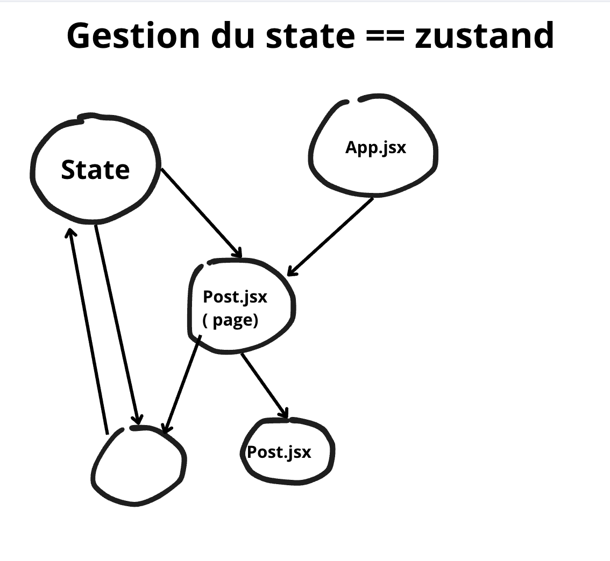

# Introduction Zustand

### 1. **Installer Zustand**
Commence par l'installer dans ton projet :
```bash
npm install zustand
```

---

### 2. **Créer un Store**
Avec Zustand, on définit son store dans un fichier séparé (ex. `store.js` ou `useStore.js`).

#### Exemple : un store simple avec une liste et des actions
```javascript
import { create } from "zustand";

const useStore = create((set) => ({
  // État initial
  users: [],

  // Actions pour manipuler l'état
  addUser: (user) =>
    set((state) => ({ users: [...state.users, user] })),
  removeUser: (id) =>
    set((state) => ({
      users: state.users.filter((user) => user.id !== id),
    })),
  clearUsers: () => set({ users: [] }),
}));

export default useStore;
```

---

### 3. **Consommer le Store dans les Composants**
Avec Zustand, on peut directement consommer le store dans ses composants sans avoir besoin de créer de contexte ou d'envelopper son application.

En image



#### Exemple 1 : Ajouter des utilisateurs
```javascript
import React, { useState } from "react";
import useStore from "./store";

function AddUser() {
  const [name, setName] = useState("");
  const addUser = useStore((state) => state.addUser);

  const handleSubmit = () => {
    addUser({ id: Date.now(), name }); // Ajoute un utilisateur avec un ID unique
    setName("");
  };

  return (
    <div>
      <input
        type="text"
        value={name}
        onChange={(e) => setName(e.target.value)}
        placeholder="Nom d'utilisateur"
      />
      <button onClick={handleSubmit}>Ajouter</button>
    </div>
  );
}

export default AddUser;
```

#### Exemple 2 : Afficher les utilisateurs
```javascript
import React from "react";
import useStore from "./store";

function UserList() {
  const users = useStore((state) => state.users); // Accède à la liste des utilisateurs
  const removeUser = useStore((state) => state.removeUser); // Action pour supprimer un utilisateur

  return (
    <div>
      <h2>Liste des utilisateurs</h2>
      <ul>
        {users.map((user) => (
          <li key={user.id}>
            {user.name}{" "}
            <button onClick={() => removeUser(user.id)}>Supprimer</button>
          </li>
        ))}
      </ul>
    </div>
  );
}

export default UserList;
```

---

### 4. **Pas besoin de Contextualiser !**
Contrairement à Redux Toolkit (qui utilise un `Provider`), Zustand fonctionne sans avoir besoin de créer un contexte global. Chaque composant peut directement accéder au store avec le hook `useStore`.

---

### 5. **Avantages de Zustand**
- **Simplicité** : Pas besoin de boilerplate ( beaucoup de code et de configuration ) comme dans Redux ou Redux Toolkit
- **Performances** : Les composants ne se re-rendent que lorsque la partie pertinente du store change.
- **Flexibilité** : Tu peux structurer ton store comme tu le souhaites.
